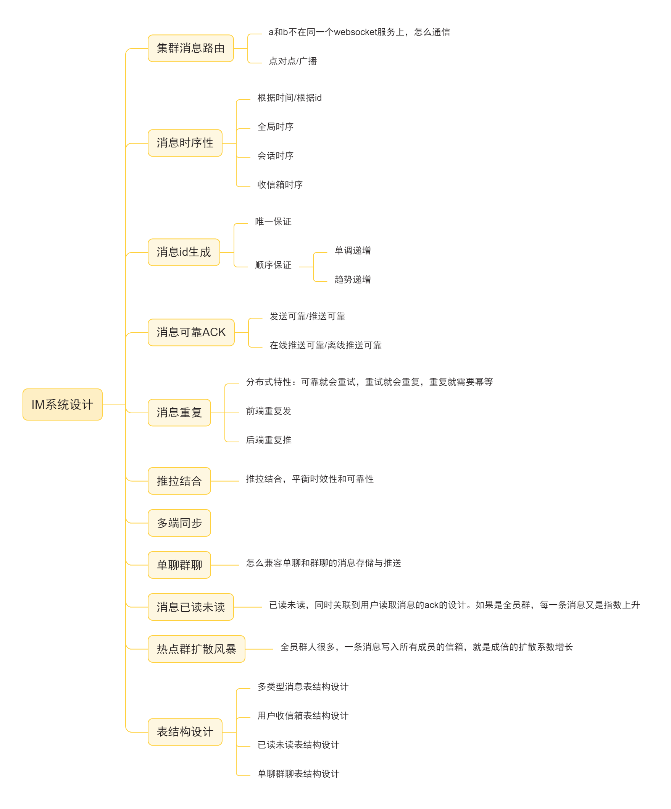
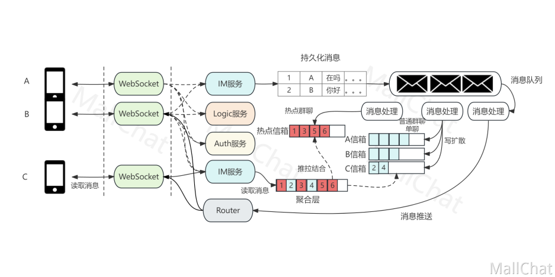
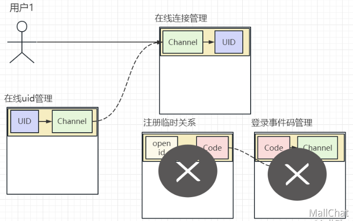

# chatRoom客服系统
今天学习了XXL-job
架构图
看面试题

消息时序性
消息id选型
消息可靠ACk
消息重复问题讨论
推拉结合
多端同步，单聊群聊表设计

复习八股文
复习咋天看的视频 然后做笔记
IM顶层设计完结
进入具体实现
明日开始代码编写
已经复习完了
游标翻页笔记+视频
联系人功能模块笔记+视频

复习八股文
前后端异步加载技术方案笔记
批量缓存笔记

支付宝通用沙箱学习